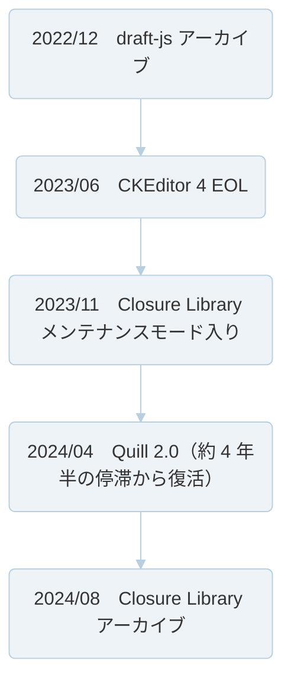

:::message
この記事は、[CYBOZU SUMMER BLOG FES '26](https://summer-blog-fes.cybozu.io/2026/)の記事です。
:::

「どのリッチテキストエディタを使うか」で 1 週間悩んだのに、「どんな形式でデータを保存するか」は 5 分で決めていませんか？

私は、エディタ選定といえば機能表とスター数を眺めるものだと思っていました。

こんにちは！サイボウズ株式会社フロントエンドエンジニアの [protein_mochi](https://x.com/protein_mochi) です。

この記事では、リッチテキストエディタ（RTE）に**触れたことがない方でも**分かるように、「エディタ選定で本当に選んでいるのはデータフォーマットである」という話を、簡単な実験を交えてお届けします。

:::message
**この記事で使う 3 つの言葉**
- **RTE**: 太字やリンクを WYSIWYG（What You See Is What You Get）で編集できる UI 部品。ブログの投稿画面やコメント欄の裏側にいるアレです。本文では単に「エディタ」とも呼びます
- **スキーマ**: 「この文書に登場してよい要素はこれだけ」という型定義。スキーマ型エディタは、型に無い内容を受け付けません
- **round-trip**: 保存されたデータをエディタで開き、**何も編集せずに**保存し直すこと。これで内容が変わるなら、そのエディタにデータは安全に任せられません
:::

## 2022–2024 年、エディタたちの動向

まず、直近数年で RTE 界に何が起きたかを時系列で眺めてみましょう。



draft-js は Meta 製で React 界の定番（後継は Lexical）[^1]、CKEditor 4 は 2012 年生まれの老舗[^2]、Closure Library は `goog.editor` という RTE を同梱していた Google 製ライブラリでした[^3]。定番だった Quill は、約 4 年半のあいだ更新が止まっていました[^4]。

わずか 2〜3 年でこの有様です。しかも、どれも「当時最善の選定」だったはずのライブラリたちです。

一方で、ユーザーがこれらエディタを使って書いた過去の文書は、**今日も開かれます**。

つまりこういうことです。**RTE は内装、データフォーマットは基礎と配管**。内装の流行は数年で変わりますが、基礎は建て替えまで残ります。

## エディタには 2 つの世代がある

なぜフォーマットがそこまで大事なのか。それを理解するために、RTE の歴史をざっくり 2 世代に分けてみます。

**第 1 世代**は、ブラウザ標準の `contenteditable`（HTML 要素をその場で編集可能にする機能）と `execCommand` をラップして機能を足していく方式です。CKEditor の開発者自身が振り返っているように、かつての WYSIWYG エディタはこの 2 つの API を土台に、ツールバーを被せる形で作られていました[^5]。手軽な反面、ブラウザへの依存は強烈でした。一つ例を挙げると、Enter キーを 1 回押したときに生成される要素は、かつて Firefox では `<br>`、IE では `<p>`、Chrome/Safari では `<div>` と、**ブラウザごとにバラバラ**だったのです[^6]。土台だった `execCommand` も、現在は MDN で非推奨（deprecated）と明記されています[^7]。

この世代の重要な特徴は、**保存されるデータが「任意の HTML」になる**ことです。ブラウザが生成するなんでもありの HTML を、そのまま受け入れて保存するしかないからです。

**第 2 世代**は、ProseMirror や Lexical に代表される、Enter・履歴・文書構造の管理を可能な限り**アプリ側の状態として持つ**方式です。ブラウザ依存という地獄から解放される代わりに、文書はスキーマで厳密に管理されます。つまり、**任意の HTML を受け付けません**。

この「任意の HTML を受け付けるか否か」という世代間の違いが、のちほど実験で目にする問題の伏線になります。

## 保存フォーマットは実質 3 択

RTE のデータ保存フォーマットは、大きく分けて 3 種類あります。「詳細は[こちら](https://example.com)を**必ず**確認」という 1 行が、それぞれのフォーマットでどう保存されるのか、見比べてみましょう。

```html
<!-- 1. HTML -->
<p>詳細は<a href="https://example.com">こちら</a>を<strong>必ず</strong>確認</p>
```

```json
// 2. 構造化 JSON（ProseMirror 系エディタの内部モデル風）
{ "type": "paragraph", "content": [
  { "type": "text", "text": "詳細は" },
  { "type": "text", "text": "こちら", "marks": [{ "type": "link", "attrs": { "href": "https://example.com" } }] },
  { "type": "text", "text": "を" },
  { "type": "text", "text": "必ず", "marks": [{ "type": "bold" }] },
  { "type": "text", "text": "確認" } ] }
```

```markdown
<!-- 3. Markdown -->
詳細は[こちら](https://example.com)を**必ず**確認
```

どれを選んでも良いですが、重要なのは、**選んだ瞬間に、将来へ課される「義務」が決まる**ことです。

| フォーマット | 得意なこと | 選んだ瞬間に発生する義務 |
| --- | --- | --- |
| HTML | 表示互換性・実装の速さ | 将来の**すべての**エディタが任意の HTML を扱えること。悪意あるスクリプトを除去する掃除処理（サニタイズ）を維持し続けること |
| 構造化 JSON | 検証・プログラムによる変換・共同編集 | スキーマの互換性を管理し続けること。エディタ実装との癒着を防ぐこと |
| Markdown | 可搬性・可読性・AI との相性 | 表現力の上限を受け入れること（拡張記法で上限を破ると、事実上の独自フォーマットと化す） |

ちなみに、フォーマットの乗り換えは「全データを一括変換して終わり」とはいきません。変更履歴や監査ログ、外部連携先などに旧形式のデータが残り続けるため、**旧形式を読む義務だけは残り続けます**。

## そのフォーマット、いずれ API になります

「保存フォーマットなんて DB の中の話でしょ？」と思うかもしれません。ところが、サービスが成長すれば、保存フォーマットはいずれ REST API の入出力として外部に顔を出すことになります。そして 2026 年現在、その API の無視できない新しい利用者として **AI エージェントが加わりました**。

象徴的なのが Notion です。もともとブロック単位の構造化 JSON を API で提供してきた Notion は、Markdown でページを読み書きする API を追加しました。公式ガイドはこれを「Markdown をネイティブに扱うエージェント系システムや開発者ツールに特に有用」と説明し[^8]、公式 MCP サーバーの README では、ブロック JSON と比べて「AI エージェントにとって大幅にトークン効率が良い」ことを理由に挙げています[^9]。Notion の答えが「正本のブロック JSON はそのままに、読み手に合わせた読み取り面を足す」だったことは示唆的です。**読み手が増えれば、契約に求められる形も増える**のです。

書き込み（データ保存）方向ではどうでしょうか。同じ「独自の構造化 JSON を受け取る書き込み API」でも、Notion と Atlassian では開発者の体験が対照的です。

- **Notion**: スキーマに合わないリクエストはまるごと 400 で拒否し、何が合わないかをエラーメッセージで返します[^10]。利用者は送信した瞬間に、失敗したことと、その理由を知ることができます
- **Atlassian（ADF）**: Jira や Confluence の本文形式である ADF は、公開仕様を持つ独自 JSON ですが[^11]、そのスキーマ定義はエディタ実装（ProseMirror ベース）と共有されています[^12]。不正な入力は拒否されるものの、所々問題の痕跡を確認できます
  - 「Comment body is not valid!」といった一言エラーからはどこが悪いのか分からないという相談[^13]
  - 公式の形式変換 API を求める Issue は、長年オープンのまま[^14]
  - コミュニティ上で Markdown と ADF を変換する非公式ライブラリが乱立している様子[^15]

両者を分けているのは、拒否の有無ではありません。**外部の利用者のために設計された契約**と、**内部モデルがそのまま外に出た契約**とでは、エラーの分かりやすさから公式の道具だけで完結できるかどうかまで、開発者体験がここまで変わるのです。

ここから、2 つの教訓が得られます。

1. **外部 API の形式をエディタの内部モデルと一体化させない**こと。内部モデルは先ほど見たとおり数年で入れ替わりますが、公開 API はそう簡単にはなくせません。

2. **書き込み API は「厳格に拒否」か「欠落を明示して変換する」かの二択にする**こと。書き込みの成功レスポンスは、本来「送ったものが忠実に保存された」という約束です。厳格に拒否すればこの約束は守られ、「変換で一部が失われる」と明示すれば約束の変更が利用者に伝わります。困るのはその中間、つまり**緩く受け取り、黙って変換し、成功を返す**設計です。約束が守られたのか誰にも分からなくなり、データの欠落は保存からずっと後、まったく別の場所で発覚します。

## 実験：15 年前の HTML を最新エディタに食べさせてみた

さて、お待ちかねの実験です。第 1 世代の RTE が生成していそうなレガシー風 HTML を用意し、第 2 世代の代表としてスキーマ型エディタの tiptap（ProseMirror ベース）に読み込ませ、**何も編集せずに**保存し直してみます。冒頭で紹介した round-trip というやつですね。

使用するのはこちら。2010 年代の社内お知らせ感を想像して作った HTML です。

```html
<div align="center"><font color="#cc0000" size="4"><b>【重要】サーバーメンテナンスのお知らせ</b></font></div>
<p>来週の<u>定例会議</u>は<span style="background-color: yellow;">中止</span>です。<br>詳細は<a href="https://example.com/notice">こちら</a>をご覧ください。</p>
<table border="1"><tbody><tr><td>日時</td><td>7月20日 15:00</td></tr><tr><td>影響範囲</td><td>全サービス</td></tr></tbody></table>
```

これを、ごく一般的な構成（段落・見出し・リスト・太字・イタリック・取り消し線・改行・リンクなどを有効化した、StarterKit 相当＋ Link）の tiptap v2 で round-trip した結果がこちらです。

```html
<p><strong>【重要】サーバーメンテナンスのお知らせ</strong></p>
<p>来週の定例会議は中止です。<br>詳細は<a target="_blank" rel="noopener noreferrer nofollow" href="https://example.com/notice">こちら</a>をご覧ください。</p>
<p>日時7月20日 15:00影響範囲全サービス</p>
```

何が起きたのか整理しましょう。

- 中央寄せ、赤色、文字サイズ、下線、黄色ハイライト：**消滅**
- テーブル：構造ごと崩壊し、「日時7月20日 15:00影響範囲全サービス」という 1 行の**呪文に変化**
- リンク：生き残ったものの、頼んでいない `target` や `rel` 属性が**勝手に追加**

そして最も恐ろしいのは、この間**エラーも警告も一切出ていない**ことです。ユーザーが古いお知らせをちょっと開いて保存しただけで、文書は静かに変わり果てます。

:::details 実験の再現手順（読み飛ばし可）
この実験は、tiptap が公式に提供する 2 つの変換関数を使い、実際にエディタを画面にマウントする代わりに、「開く」と「保存する」で通る変換経路だけを取り出して実行したものです。

```bash
npm install @tiptap/html@2 @tiptap/starter-kit@2 @tiptap/extension-link@2
```

```js
// roundtrip.mjs — node roundtrip.mjs で実行
import { generateJSON, generateHTML } from "@tiptap/html";
import StarterKit from "@tiptap/starter-kit";
import Link from "@tiptap/extension-link";

const extensions = [StarterKit, Link];

const legacyHTML = `（本文のサンプル HTML をここに）`;

const json = generateJSON(legacyHTML, extensions); // 「開く」に相当（HTML → スキーマ準拠の文書 JSON）
const html = generateHTML(json, extensions); // 「保存し直す」に相当（文書 JSON → HTML）
console.log(html);
```

なお、バージョンを `@2` に固定しているのは、v3 では StarterKit に含まれる拡張が変わり、実験結果も変わるためです。
:::

種明かしをすると、これはバグではなく**仕様**です。ProseMirror 系エディタは、スキーマに適合しないコンテンツを黙って捨てると公式に文書化されています[^16]。対極の設計として、CKEditor 5 には専用プラグインが無いマークアップも温存する公式機能（General HTML Support）があります[^17]。ただし、その公式ドキュメント自身が「すべての HTML 機能を有効にするとセキュリティリスクが生じる」として、危険な要素の除外リストの併用を促しています。なんでも温存する方式は、安全性や文書構造の綺麗さを犠牲にしやすいのです。

つまり、**スキーマの厳格さと HTML の忠実さはトレードオフ**であり、どちらが正解かはエディタの良し悪しではなく、**自分たちのプロダクトに眠っている既存データが決める**のです。

そしてこの変換が一方通行であるせいで、長く使われているプロダクトでは「新しいエディタを導入しても、既存データを開くために古いエディタを消せない」という併走が起きがちです。

## RTE 選定チェックリスト

というわけで、次に RTE を選ぶ機会があれば、このリストを思い出してみてください。全部は無理でも、**1 と 3 だけは選定前に**やってみる価値があると思います。

1. **フォーマットから決める**——HTML / 構造化 JSON / Markdown を先に選び、エディタは「その実装」として選ぶ
2. 編集面を分類する——既存コンテンツを開くか？出力は誰が消費するか？共同編集は？など
3. **選定前に round-trip テスト**——実データ相当の文書を候補エディタで load → save → diff する
4. ラッパーを作るなら、エディタ固有の型やイベントを外に漏らさない
5. 外部 API の形式を、エディタの内部モデルと一体化させない
6. 書き込み API は「厳格検証で拒否」か「欠落を明示した変換」の二択にする
7. AI エージェントも読み手に数える——Markdown での読み取り手段の併設を検討する
8. 旧エディタがある場合は、新エディタの導入の際に旧エディタの退役計画をセットで付ける
9. サニタイズやメンションなどの横断的関心事は、特定のエディタに依存しない層に置く

## 終わり

エディタは入れ替わります。データは残ります。**保存フォーマットは、実質無期限契約です。**

次に RTE を選定する際には、機能比較表を開く前に、以下を問いかけてみてください。

**「このコンテンツは何年生きて、その間にエディタは何回死に、読み書きする相手は誰に変わっているだろうか？」**

[^1]: https://github.com/facebookarchive/draft-js
[^2]: https://ckeditor.com/blog/ckeditor-4-end-of-life/
[^3]: https://github.com/google/closure-library/issues/1214
[^4]: https://slab.com/blog/announcing-quill-2-0/ （更新間隔は https://github.com/slab/quill/releases より。v1.3.7 が 2019 年 9 月、v2.0.0 が 2024 年 4 月）
[^5]: https://ckeditor.com/blog/ContentEditable-The-Good-the-Bad-and-the-Ugly/#the-editing-task-force
[^6]: https://bugzilla.mozilla.org/show_bug.cgi?id=1297414 （Firefox が `<br>` の生成をやめ、他ブラウザに挙動を揃えた際の議論。各ブラウザの当時の挙動も記録されています）
[^7]: https://developer.mozilla.org/en-US/docs/Web/API/Document/execCommand
[^8]: https://developers.notion.com/guides/data-apis/working-with-markdown-content
[^9]: https://github.com/makenotion/notion-mcp-server#page-content-as-markdown
[^10]: https://developers.notion.com/reference/status-codes#error-codes
[^11]: https://developer.atlassian.com/cloud/jira/platform/apis/document/structure/
[^12]: Atlassian のエディタは ProseMirror 上に構築されており（https://www.npmjs.com/package/@atlaskit/editor-core ）、公式パッケージ @atlaskit/adf-schema は、パッケージ説明文（package.json の description）を参考（https://www.npmjs.com/package/@atlaskit/adf-schema?activeTab=code）
[^13]: https://community.atlassian.com/forums/Jira-questions/Jira-Cloud-REST-API-Unable-to-add-comment-via-ADF-receiving-quot/qaq-p/2808955
[^14]: https://jira.atlassian.com/browse/JRACLOUD-77436
[^15]: https://github.com/jamsinclair/marklassian や https://github.com/julianlam/adf-to-md など
[^16]: https://tiptap.dev/docs/editor/core-concepts/schema
[^17]: https://ckeditor.com/docs/ckeditor5/latest/features/html/general-html-support.html
